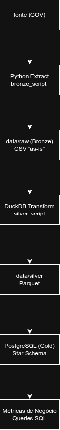
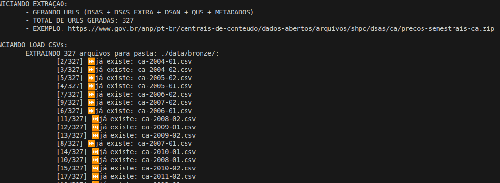
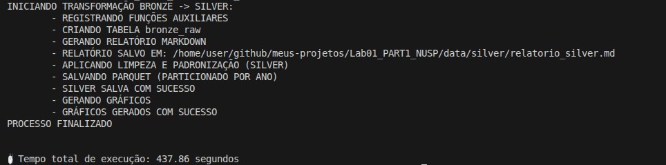
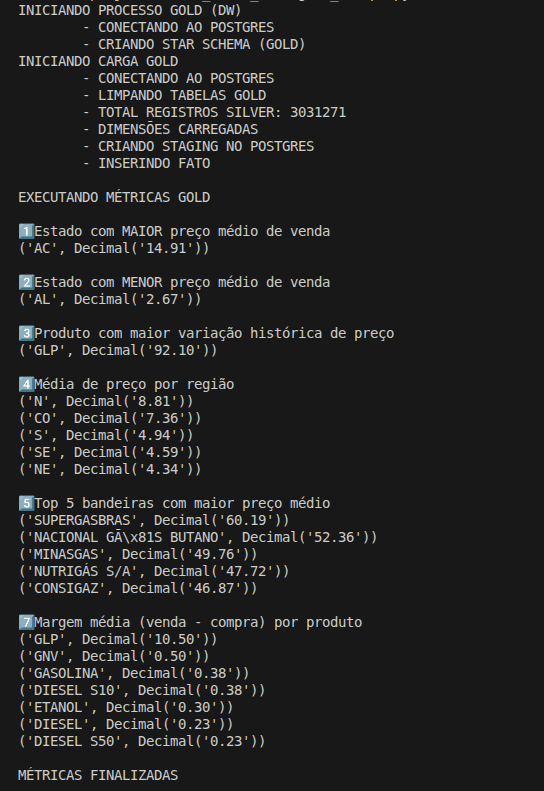
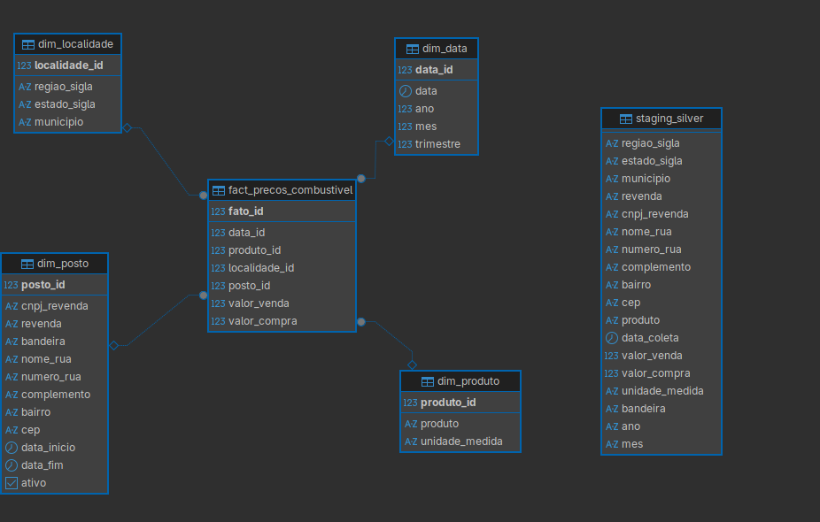
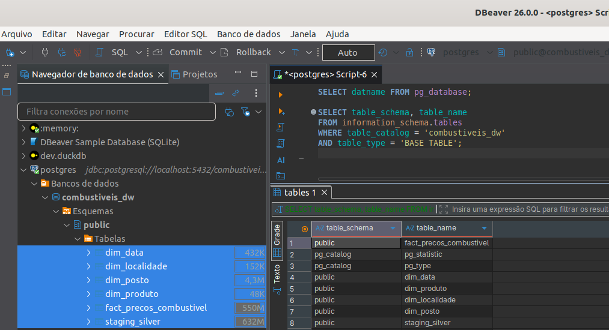

# 📊 Lab01_PART1_18107162  
**LABORATÓRIO 01-A:** Ingestão de Dados End-to-End (Local)
**Aluno:** Victor Lira Carlos de Paula
**NUSP:** 18107162
**Matéria:** Fundamentos de Engenharia de Dados

---

## 📌 1. Visão Geral do Projeto

Este projeto tem como objetivo implementar um pipeline completo de Engenharia de Dados utilizando a **Medallion Architecture (Bronze, Silver e Gold)**.

O dataset escolhido foi o **Série Histórica de Preços de Combustíveis e de GLP**, disponível no Gob:

🔗 https://dados.gov.br/dados/conjuntos-dados/serie-historica-de-precos-de-combustiveis-e-de-glp

---

## 2. Arquitetura:




---

## 🗂️ 3. Documentação da Tarefa:

### Bronze Script:

Responsável pela extração dos dados públicos de preços de combustíveis.

* Faz download dos CSVs a partir da DATASET_URL.
* Salva os arquivos sem alterações em data/raw/.
* Mantém os dados no formato original ("as-is").



### Silver Script:

Responsável pela limpeza e transformação dos dados utilizando DuckDB.

* Padroniza nomes de colunas (snake_case).
* Converte tipos (datas, numéricos).
* Trata valores nulos.
* Remove duplicatas.
* Gera estatísticas básicas de qualidade.
* Salva os dados tratados em Parquet.



### Gold Script:

Responsável pela modelagem analítica no PostgreSQL.

* Cria o Star Schema.
* Carrega dados da Silver para o banco.
* Executa métricas de negócio via SQL.





---

## 🔎 4. Dicionário de Dados:

## Tipos de Colunas
| column_name    | column_type | null | Descrição                                                                              |
| :------------- | :---------- | :--- | :------------------------------------------------------------------------------------- |
| regiao_sigla   | VARCHAR     | YES  | Sigla da região brasileira onde a revenda está localizada (ex: SE, S, NE).             |
| estado_sigla   | VARCHAR     | YES  | Sigla da Unidade Federativa (UF) da revenda pesquisada (ex: SP, RJ).                   |
| municipio      | VARCHAR     | YES  | Nome do município onde foi realizada a coleta de preços.                               |
| revenda        | VARCHAR     | YES  | Nome do posto ou estabelecimento revendedor pesquisado.                                |
| cnpj_revenda   | VARCHAR     | YES  | Número do CNPJ da revenda pesquisada.                                                  |
| nome_rua       | VARCHAR     | YES  | Nome do logradouro da revenda (rua, avenida, etc.).                                    |
| numero_rua     | VARCHAR     | YES  | Número do logradouro da revenda.                                                       |
| complemento    | VARCHAR     | YES  | Complemento do endereço da revenda (sala, lote, etc.).                                 |
| bairro         | VARCHAR     | YES  | Nome do bairro onde a revenda está localizada.                                         |
| cep            | VARCHAR     | YES  | Código de Endereçamento Postal (CEP) da revenda.                                       |
| produto        | VARCHAR     | YES  | Nome do combustível pesquisado (ex: Gasolina C, Etanol, Diesel B, GNV, GLP P13).       |
| data_coleta    | VARCHAR     | YES  | Data em que o preço foi coletado na pesquisa da ANP.                                   |
| valor_venda    | VARCHAR     | YES  | Preço de venda ao consumidor final praticado na data da coleta.                        |
| valor_compra   | VARCHAR     | YES  | Preço de compra do combustível junto à distribuidora (quando disponível).              |
| unidade_medida | VARCHAR     | YES  | Unidade de medida do produto (ex: R$/litro, R$/13kg).                                  |
| bandeira       | VARCHAR     | YES  | Marca da distribuidora associada ao posto (ou "Bandeira Branca" quando não vinculada). |

---

### 📊 5. Relatório de Qualidade de Dados

## Total de Registros
34078511

## Contagem de Nulos
|   regiao_sigla_nulls |   estado_sigla_nulls |   municipio_nulls |   revenda_nulls |   cnpj_revenda_nulls |   nome_rua_nulls |   numero_rua_nulls |   complemento_nulls |   bairro_nulls |   cep_nulls |   produto_nulls |   data_coleta_nulls |   valor_venda_nulls |   valor_compra_nulls |   unidade_medida_nulls |   bandeira_nulls |
|---------------------:|---------------------:|------------------:|----------------:|---------------------:|-----------------:|-------------------:|--------------------:|---------------:|------------:|----------------:|--------------------:|--------------------:|---------------------:|-----------------------:|-----------------:|
|                10350 |                10350 |             10350 |           10350 |                10350 |            10350 |              23686 |            25572469 |          92868 |       10350 |           10350 |               10351 |               10351 |             21752408 |                 146828 |            44070 |

## Duplicidade Geral
- Total de registros: 34078511
- Registros duplicados: 2321752
- Percentual de duplicidade: 6.81%

---

### ⚙️ 6. Instruções de Execução

Perfeito — vou manter **formato em bullet points**, mas organizado e profissional.

---

## ⚙️ 6. Instruções de Execução

* Instalar as dependências do projeto:

```bash
pip install -r requirements.txt
```

* Executar a camada **Bronze** para realizar o download dos CSVs e armazená-los em `data/raw/`:

```bash
python bronze_script.py
```

* Executar a camada **Silver** para tratamento, padronização e geração dos arquivos Parquet em `data/silver/`:

```bash
python silver_script.py
```

* Subir o ambiente do PostgreSQL via Docker:

```bash
docker compose build
docker compose up
```

* Em outro terminal, executar a camada **Gold** para criação do Star Schema, carga dos dados e execução das métricas:

```bash
python gold_script.py
```

* Após a execução completa, o Data Warehouse poderá ser acessado via DBeaver, pgAdmin ou qualquer outro cliente PostgreSQL.



---

# Gráficos Exploratórios

## 1️⃣ Distribuição do Preço de Venda


## 2️⃣ Preço Médio por Estado


## 3️⃣ Preço Médio por Produto


## 4️⃣ Evolução Média por Ano


## 5️⃣ Top 10 Bandeiras
