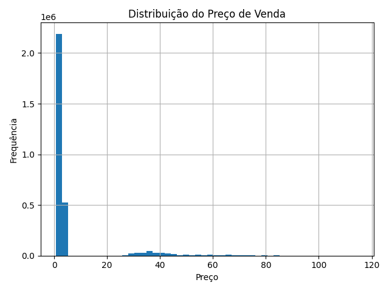
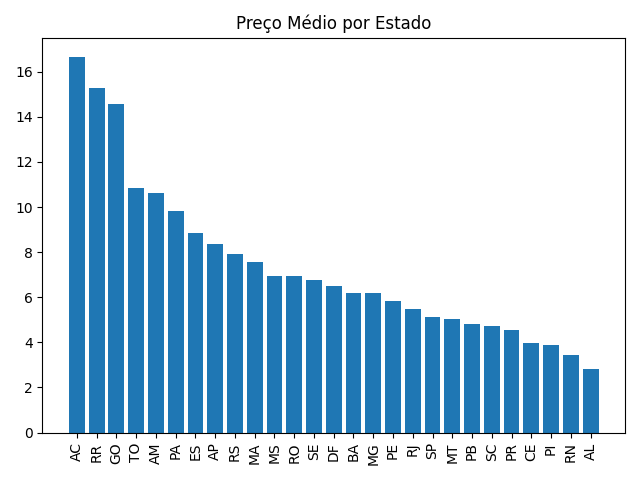
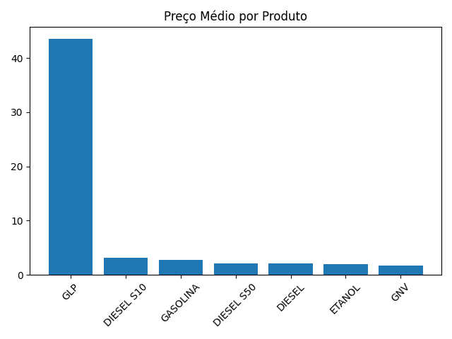
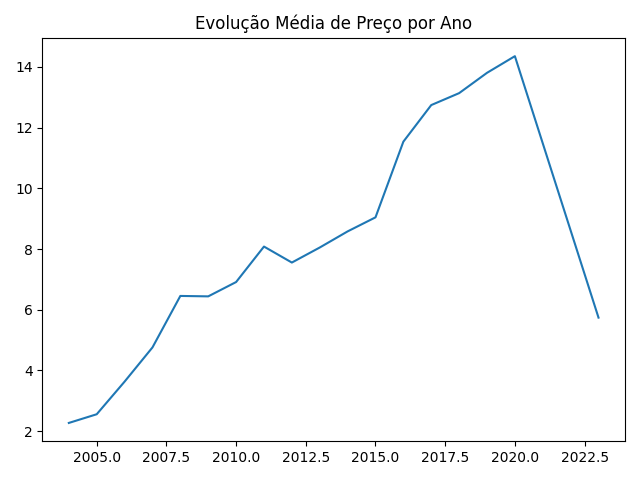
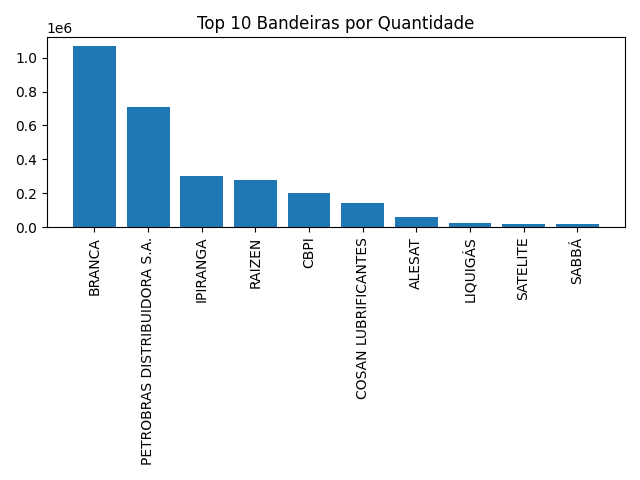

# Relatório Camada Silver (Pré-Tratamento)

## Total de Registros
34078511

## Tipos de Colunas
| column_name    | column_type   | null   | key   | default   | extra   |
|:---------------|:--------------|:-------|:------|:----------|:--------|
| regiao_sigla   | VARCHAR       | YES    |       |           |         |
| estado_sigla   | VARCHAR       | YES    |       |           |         |
| municipio      | VARCHAR       | YES    |       |           |         |
| revenda        | VARCHAR       | YES    |       |           |         |
| cnpj_revenda   | VARCHAR       | YES    |       |           |         |
| nome_rua       | VARCHAR       | YES    |       |           |         |
| numero_rua     | VARCHAR       | YES    |       |           |         |
| complemento    | VARCHAR       | YES    |       |           |         |
| bairro         | VARCHAR       | YES    |       |           |         |
| cep            | VARCHAR       | YES    |       |           |         |
| produto        | VARCHAR       | YES    |       |           |         |
| data_coleta    | VARCHAR       | YES    |       |           |         |
| valor_venda    | VARCHAR       | YES    |       |           |         |
| valor_compra   | VARCHAR       | YES    |       |           |         |
| unidade_medida | VARCHAR       | YES    |       |           |         |
| bandeira       | VARCHAR       | YES    |       |           |         |

## Contagem de Nulos
|   regiao_sigla_nulls |   estado_sigla_nulls |   municipio_nulls |   revenda_nulls |   cnpj_revenda_nulls |   nome_rua_nulls |   numero_rua_nulls |   complemento_nulls |   bairro_nulls |   cep_nulls |   produto_nulls |   data_coleta_nulls |   valor_venda_nulls |   valor_compra_nulls |   unidade_medida_nulls |   bandeira_nulls |
|---------------------:|---------------------:|------------------:|----------------:|---------------------:|-----------------:|-------------------:|--------------------:|---------------:|------------:|----------------:|--------------------:|--------------------:|---------------------:|-----------------------:|-----------------:|
|                10350 |                10350 |             10350 |           10350 |                10350 |            10350 |              23686 |            25572469 |          92868 |       10350 |           10350 |               10351 |               10351 |             21752408 |                 146828 |            44070 |

## Duplicidade Geral
- Total de registros: 34078511
- Registros duplicados: 2321752
- Percentual de duplicidade: 6.81%

# Gráficos Exploratórios

## 1️⃣ Distribuição do Preço de Venda

## 2️⃣ Preço Médio por Estado

## 3️⃣ Preço Médio por Produto

## 4️⃣ Evolução Média por Ano

## 5️⃣ Top 10 Bandeiras

